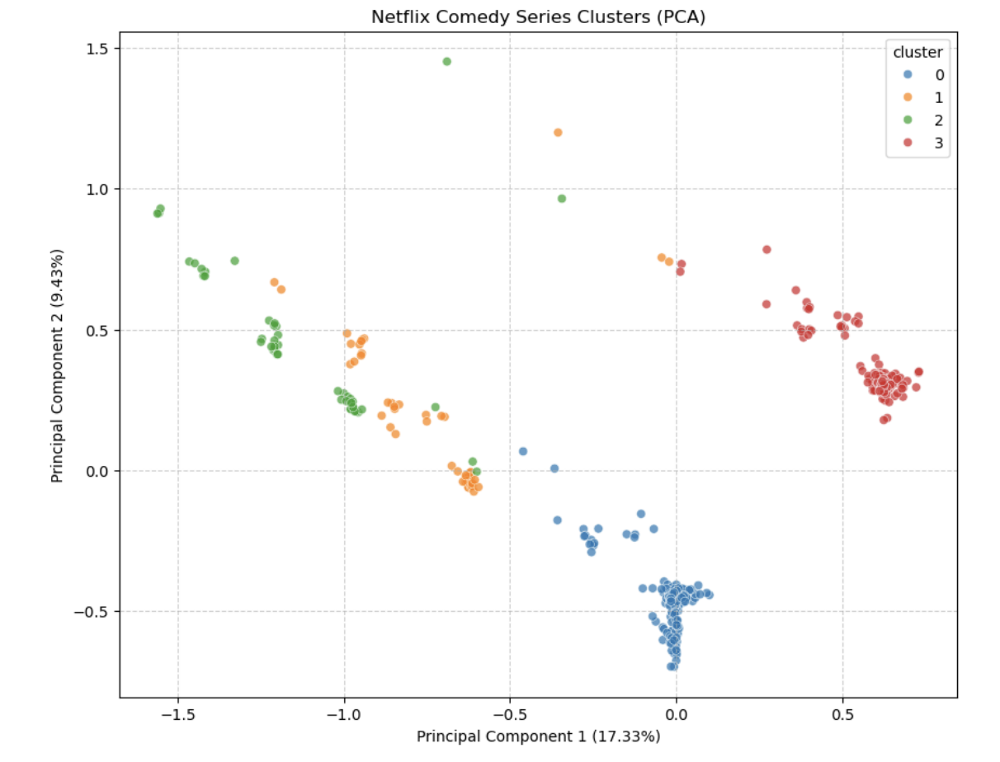

# Beyond the Binge: Segmenting Netflix Comedy Viewers for Targeted CTV Ad Strategies

## 1. Project Background

The landscape of television consumption is undergoing a rapid transformation, largely driven by the proliferation of ad-supported streaming platforms. A significant indicator of this shift is Netflix's announcement in May 2025: its ad-supported tier now boasts a substantial 94 million monthly active users. This remarkable growth fuels considerable investment in Connected TV (CTV) advertising. However, merely reaching a vast audience is insufficient; effective advertising demands genuine connection. This project directly addresses a critical need: understanding specific viewer preferences to ensure advertising budgets are allocated with maximum efficacy. I meticulously analyzed Netflix comedy TV series, a universally popular content category, to identify distinct audience segments. My core objective is to equip advertisers with precise, data-driven insights for more targeted ad placements and optimized budget allocation.

## 2. Executive Summary

In light of the imperative to effectively engage millions of new Netflix ad-tier users, this project employed a precise analytical process to map viewer preferences. By meticulously analyzing 460 Netflix comedy TV series, I transformed raw content data into a clear representation of audience tastes. This in-depth analysis revealed four distinct and valuable audience segments: The Everyday Laughter Seeker, The Intellectually Curious Animation Buff, The Family-Friendly Adventure Curator, and The Relationship & Dramedy Explorer. For advertisers, this granular understanding offers an unparalleled opportunity to significantly maximize their return on investment. By tailoring campaigns directly to these unique segments, marketers can achieve far greater impact than through generic approaches, ensuring advertising is highly relevant and budgets are utilized with optimal effectiveness.

## 3. The Analytical Process

Understanding true audience enjoyment requires a systematic and structured approach. This project utilized a multi-step analytical process to transform raw information into actionable insights.

### 3.1. Data Acquisition

The initial phase involved acquiring comprehensive content data for 460 Netflix comedy series available in the US and Canada. I accomplished this by interacting with The Movie Database (TMDB) API. This step secured essential foundational data, including plot summaries, cast details, genre classifications, descriptive keywords, and viewer ratings, which provided the preliminary clues for audience preferences.

### 3.2. Data Preparation

Raw data inherently contains inconsistencies and varied formats, necessitating a thorough preparation phase. This step focused on combining and standardizing textual content, while numerical figures were meticulously cleaned and normalized. This crucial process ensured data consistency and usability for subsequent machine learning algorithms, effectively crafting a precise "digital DNA" for each series.

### 3.3. Feature Engineering

Next, each show's qualitative attributes were translated into a high-dimensional content profile—a numerical representation readily processed by computers.

- **Text Features**: TF-IDF vectorization was employed using a TfidfVectorizer. This method identified words or phrases most uniquely powerful in defining a show's content, capturing even subtle taste distinctions.

- **Categorical Features**: Genres, where shows often possess multiple classifications, were precisely encoded using a MultiLabelBinarizer. This ensured these multi-value categories accurately contributed to each show's overall profile.

- **Numerical Features**: Metrics such as average viewer rating and seasons were scaled using a MinMaxScaler. This step ensured all numerical features contributed equally to the analysis, preventing larger values from disproportionately influencing the results.

### 3.4. Audience Clustering

Finally, distinct audience clusters were identified. The K-Means algorithm was applied to group these detailed content profiles based on their inherent similarities. This process effectively organized the vast content library into clear, discrete segments. The selection of 4 clusters was strategically determined using statistical guides such as the Elbow Method and Silhouette Score, ensuring the resulting audience groups were both clear and highly actionable. Robustness and reproducibility of the findings were further ensured through multiple algorithm runs with fixed initializations. This comprehensive process successfully transformed raw data into precise, actionable audience profiles, directly enabling highly targeted advertising strategies.

## 4. Key Discovery: Unveiling Unique Comedy Audiences

My precise analytical process culminated in a pivotal discovery: four distinct, highly unique audience segments within Netflix comedy. This unparalleled level of precision indicates that four tailored campaigns can significantly outperform a single, generic advertising approach, directly maximizing return on investment for advertisers.

These unique audience profiles, or personas, were meticulously identified based on their specific content preferences:

- **The Everyday Laughter Seeker**: This persona favors comforting, familiar humor. Their content preferences are defined by keywords such as 'comedy', 'standup', and 'sitcom', indicating an affinity for traditional sitcoms and broadly accessible stand-up comedy.  
  *Examples: Arrested Development, Comedians in Cars Getting Coffee*

- **The Intellectually Curious Animation Buff**: This segment seeks sophisticated, adult-oriented animated comedies that often blend with genres such as sci-fi or fantasy. Their humor is sharp and frequently incorporates dark themes. Keywords like 'animation', 'adult', and 'satirical' accurately define their unique taste.  
  *Examples: BoJack Horseman, Disenchantment*

- **The Family-Friendly Adventure Curator**: This persona primarily comprises parents actively seeking wholesome yet exciting animated comedies suitable for young children. Their content is characterized by themes of 'adventure', 'family', and positive messages, often featuring 'slapstick' humor.  
  *Examples: The Epic Tales of Captain Underpants, The Boss Baby: Back in Business*

- **The Relationship & Dramedy Explorer**: This audience finds humor in the complexities of human connections. They appreciate comedies that skillfully weave laughter with 'drama', 'romance', or even 'mystery'. Keywords such as 'love', 'relationship', and 'friendship' define their preferred narratives.  
  *Examples: Ginny & Georgia, Orange Is the New Black*

Each identified persona represents a precise, actionable target, transforming a vast, undifferentiated audience into clearly defined segments ready for tailored engagement.

## 5. Recommendations

The identified audience personas offer a clear and strategic pathway for digital marketers to significantly enhance their impact on Netflix:

- **Precision Content Targeting**: Move beyond broad comedy categories. Align ad placements directly with specific Netflix comedy series that resonate profoundly with a particular target persona. This ensures ads appear in highly relevant content environments, dramatically boosting their effectiveness and perceived value.

- **Tailored Creative Development**: Discard generic campaigns. Instead, develop ad creatives and messaging meticulously customized for each persona's unique humor style, interests, and underlying needs. This approach fosters genuine connection and avoids ad fatigue.

- **Optimized Budget Allocation**: Shift media spend from inefficient, wide targeting to highly specific placements within Netflix's content library. This data-driven strategy directly maximizes return on investment by ensuring every dollar reaches the most receptive audience.

- **Informed Content Strategy**: Leverage these insights to guide future content acquisition or development decisions. Understanding precisely what unique audiences desire helps pinpoint content gaps and drive deeper, more sustained platform engagement.
